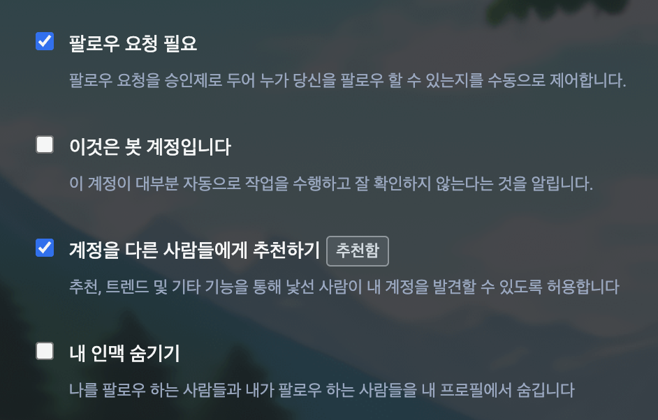

# 프로필 변경
[[toc]]
프로필 정보는 [프로필 편집](https://ani.work/settings/profile) 페이지에서 변경할 수 있습니다.
## 기본 정보 변경

이 영역은 다른 이용자가 내 프로필을 열람할 때 가장 먼저 보이는 부분을 수정하는 페이지입니다.

표시되는 이름은 서비스 내에서 사용하는 이름이며, 자기소개는 다른 이용자가 내 프로필을 조회할 때 보이는 소개글입니다.
### 예시 이미지

## 메타데이터 설정

메타데이터는 링크나 설명을 삽입할 수 있는 공간입니다.

운영하는 사이트나 프로필 페이지가 있는 경우, 검증 링크를 페이지에 삽입하고 나서 메타데이터를 입력하면 서버가 직접적인 검증을 진행하여 본인임을 증명합니다.
### 예시 이미지

## 계정을 비밀계정으로 만들기
::: warning 주의
비밀계정일 때 작성한 글은 해제하고 나서도 다른 이용자에게 보이지 않을 수 있습니다. 
더불어 공개로 작성한 게시물은 비밀 계정이라고 하더라도 다른 이용자에게 보여집니다.
:::

- 팔로우 요청 필요 옵션 + 내 인맥 숨기기 체크박스에 체크합니다.

- [사용자 설정](https://ani.work/settings/preferences/other) 페이지에서 게시물 프라이버시를 비공개로 전환합니다.

## 계정 이전 및 삭제

### 계정 옮기기

- 원격 서버에 계정을 생성한 뒤, 애니워크에서 해당 계정으로 로그인을 진행하면 애니워크 계정을 다른 서버로 옮길 수 있습니다.

### 계정 삭제
::: danger 경고
계정을 삭제하면 되돌릴 수 없습니다. 신중하게 생각해주세요.
:::

- 계정을 삭제합니다.
- 이 요청은 삭제 후 되돌릴 수 없으며, 관리자나 중재자가 계정을 복구해주지 않습니다.