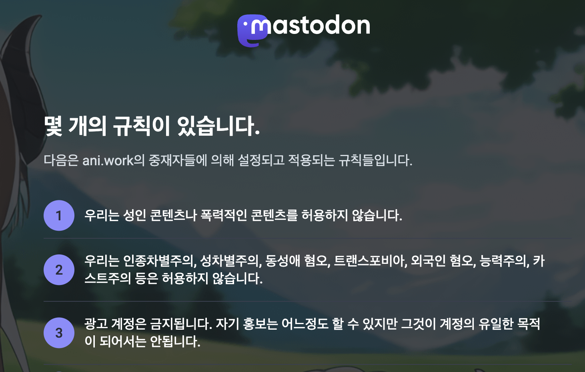
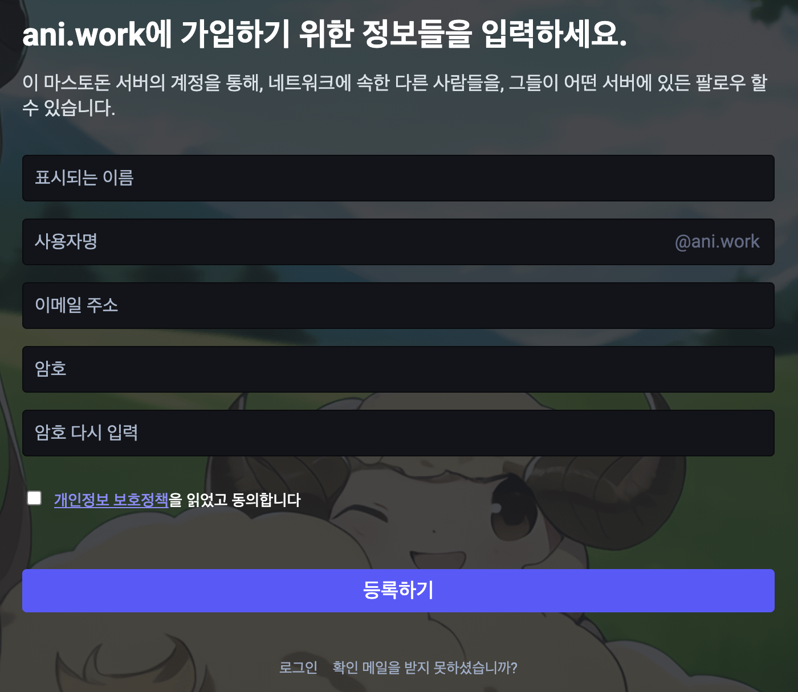

# 애니워크 계정생성
계정생성은 [계정생성 페이지](https://ani.work/auth/sign_up)에서 진행합니다.

개인정보 정책 및 이용약관은 [개인정보 정책](https://ani.work/privacy-policy) 내에 존재하므로, 해당 페이지를 반드시 읽어주시기 바랍니다.

## 규칙 동의

애니워크 네트워크는 서비스 이용을 이용자 자율에 맡기는 만큼, 몇 가지의 규칙이 존재합니다. 
최소한의 규칙을 지키지 않으면, 애니워크 네트워크에 가입할 수 없습니다.

## 정보입력

정보는 이메일 주소 및 암호를 제외하고 별도의 정보를 받지 않습니다.

가입 후 이메일 인증을 반드시 진행해야하며, 가입 후 프로필 사진을 애니메이션 및 만화 등의 프로필 사진으로 변경하지 않으면 모더레이터에 따라 계정정지 조치를 내릴 수 있으니 프로필 사진 변경도 필히 진행하시기 바랍니다.